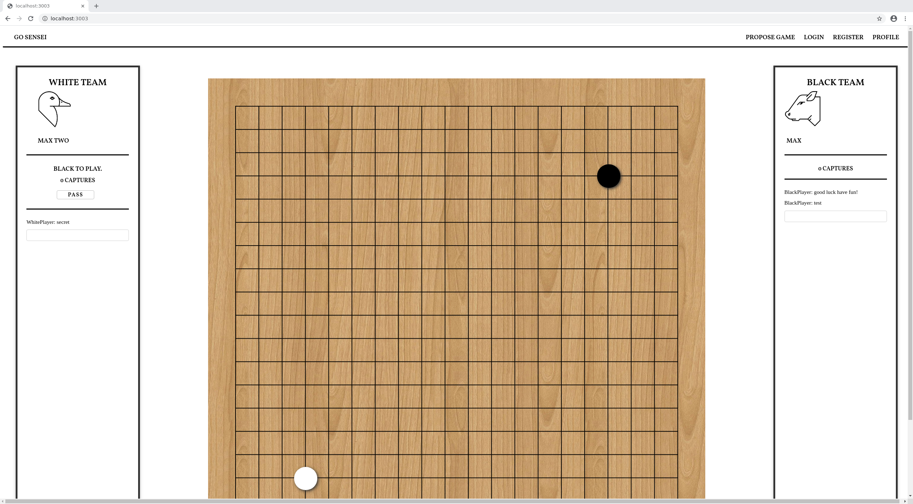

Liberty Go Server
---

This repository contains an API server based on Servant and a client based on Reflex, which are used to create a full stack, open-source, Haskell Baduk Server!

This library uses the [Liberty Go Logic](https://github.com/Maxfield-Chen/liberty-go-logic) repository to perform the logic of the Baduk game.

This library powers [Go Sensei]() which is an effort to connect Baduk students and teachers by providing structured reviews. Go Sensei asks each student to choose a focus for each game they play. Stronger teachers can then review the student's game and give them feedback on ways to improve their game based on the focus they chose.

This focus based review system also allows students to search for games which highlight the issues they've been struggling with. If you have trouble playing with influence, you can search for games where students were working on that particular aspect of their game.

## Setup

Run the back-end server on port 8888 with the following command:

    nix-shell -A shells.ghc --run "cabal new-run lgs"

Run the front-end server on port 3003 with the following command:

    nix-shell -A shells.ghc --run "cabal new-run lgc"

Run the documentation server on port 9999 with the following command:

    nix-shell -A shells.ghc --run "hoogle server --local --port 9999"

The single origin policy will block access from the front and back-end server in development. To bypass this issue, run chrome with the following flags:

    google-chrome-stable --disable-web-security --user-data-dir=/tmp

You can use ghcid to have your changes updated in realtime, highly recommended for development!

Made with love by [Maxfield Chen](https://maxfieldchen.com)
